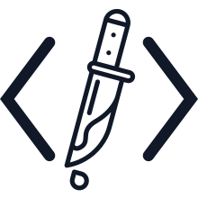

# My Code, My Kill

> **제대로 쌓아올리고,
제대로 무너뜨립니다.**

---

## Abstract

`My Code, My Kill`은 웹 보안 취약점을 직접 재현하고 분석하며 대응까지 이어가는 실습형 프로젝트입니다.

## Commit Emoji Guide

| emoji | commit message | when to use it              |
| :---: | :------------: | :-------------------------: |
| 🎉    | Start          | 프로젝트 시작               |
| ✨    | Feat           | 새로운 기능 추가            |
| 🐛    | Fix            | 버그 수정                   |
| ♻️    | Refactor       | 코드 리팩터링               |
| 💄    | Style          | 스타일 추가 및 업데이트     |
| 📦    | Chore          | 패키지 추가 및 업데이트     |
| 📚    | Docs           | 그 외 문서 추가 및 업데이트 |

<!-- 

🎉 Start: 
✨ Feat: 
🐛 Fix: 
♻️ Refactor: 
💄 Style: 
📦 Chore: 
📚 Docs: 

-->

## Docs Hub

### Quick Start

| 문서 | 설명 |
| --- | --- |
| [`docs/first-run-docker.md`](./docs/first-run-docker.md) | 로컬 Docker 첫 실행 가이드 |
| [`docs/first-run-vm.md`](./docs/first-run-vm.md) | VM 첫 실행 가이드 |

### Scripts

| 문서 | 설명 |
| --- | --- |
| [`docs/how-to-docker.md`](./docs/how-to-docker.md) | Docker 운영 명령 모음 |

### Guides

| 문서 | 설명 |
| --- | --- |
| [`docs/xss-filter-guide.md`](./docs/xss-filter-guide.md) | XSS 실습 설정 가이드 |

## Links

- [GitHub](https://github.com/irondenker/my-code-my-kill)
- [Project Blog](https://irondenker.tistory.com/category/Projects)

## References

- <https://getbootstrap.com/docs/5.3/examples/>
- <https://www.toptal.com/developers/gitignore>
- <https://techicons.dev/>
- <https://www.flaticon.com/kr/>
- <https://www.svgrepo.com/>
- <https://icons.getbootstrap.com/>

## License

This project is licensed under the MIT License.  
See [`LICENSE`](./LICENSE) for details.
