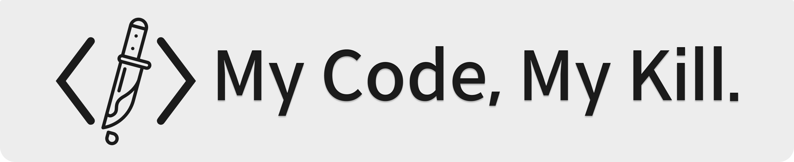
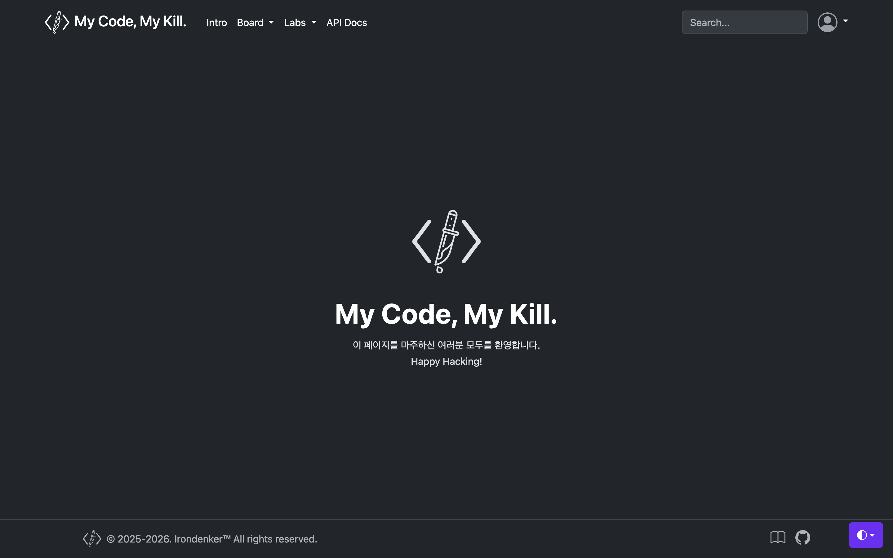

# My Code, My Kill





---

## Abstract

`My Code, My Kill`은 웹 보안 취약점을 직접 재현하고 분석하며 대응까지 이어가는 실습형 프로젝트입니다.

## Local QA Gate

수동 QA를 줄이기 위해 로컬 git hook을 활성화하면 커밋/푸시 시 자동 검증이 실행됩니다.

```bash
git config core.hooksPath .githooks
```

- `pre-commit`: `(cd server && npm run test)`
- `pre-push`: `(cd server && npm run build && npm run check:openapi-drift)`
  - 현재 브랜치가 `main`/`master`면 `npm run test:db`를 자동 실행합니다.
  - `RUN_DB_TESTS=1`: 브랜치와 무관하게 DB 테스트 강제 실행
  - `RUN_DB_TESTS=0`: 브랜치와 무관하게 DB 테스트 강제 생략

도커 기반으로 훅을 실행하려면 아래처럼 실행합니다.

```bash
USE_DOCKER_HOOKS=1 git commit
USE_DOCKER_HOOKS=1 RUN_DB_TESTS=1 git push
RUN_DB_TESTS=0 git push
```

- 기본 compose 파일은 `docker-compose.yml`입니다.
- 다른 compose 파일을 사용하면 `DOCKER_COMPOSE_FILE`로 지정할 수 있습니다.
- 도커 훅 모드에서는 `server` 컨테이너가 실행 중이어야 합니다.

```bash
cd server
npm run test:db
```

- `test:db`는 실제 DB에 쓰기/읽기/삭제를 수행하는 서비스 통합 테스트입니다.
- 실행 전 DB 기동/마이그레이션/시드가 완료되어 있어야 합니다.

```bash
docker compose -f docker-compose.yml exec -T server npm run test:db
```

## Solo Dev Mode (Optional)

1인 개발이라면 GitHub 브랜치 보호(룰셋)를 끄고 빠르게 개발해도 됩니다.

1. GitHub `Settings > Rules > Rulesets`에서 `main` 대상 ruleset을 `Disable` 또는 삭제합니다.
2. 로컬 훅은 유지합니다.
3. 배포 전에는 아래 명령을 최소 1회 실행합니다.

```bash
cd server
npm run test
npm run build
npm run test:db
```

도커 기반이면 아래처럼 실행합니다.

```bash
docker compose -f docker-compose.yml exec -T server npm run test
docker compose -f docker-compose.yml exec -T server npm run build
docker compose -f docker-compose.yml exec -T server npm run test:db
```

## Commit Emoji Guide

| emoji | commit message | when to use it              |
| :---: | :------------: | :-------------------------: |
| 🎉    | Start          | 프로젝트 시작               |
| ✨    | Feat           | 새로운 기능 추가            |
| 🐛    | Fix            | 버그 수정                   |
| ♻️    | Refactor       | 코드 리팩터링               |
| 💄    | Style          | 스타일 추가 및 업데이트     |
| 📦    | Chore          | 패키지 추가 및 업데이트     |
| 📚    | Docs           | 그 외 문서 추가 및 업데이트 |

<!-- 

🎉 Start: 
✨ Feat: 
🐛 Fix: 
♻️ Refactor: 
💄 Style: 
📦 Chore: 
📚 Docs: 

-->

## Docs Hub

### Quick Start

| 문서 | 설명 |
| --- | --- |
| [`docs/first-run/first-run-docker.md`](./docs/first-run/first-run-docker.md) | 로컬 Docker 첫 실행 가이드 |
| [`docs/first-run/first-run-vm.md`](./docs/first-run/first-run-vm.md) | VM 첫 실행 가이드 |

### Scripts

| 문서 | 설명 |
| --- | --- |
| [`docs/how-to-docker.md`](./docs/how-to-docker.md) | Docker 운영 명령 모음 |

### Guides

| 문서 | 설명 |
| --- | --- |
| [`docs/lab-guide/xss-filter-guide.md`](./docs/lab-guide/xss-filter-guide.md) | XSS 실습 설정 가이드 |
| [`docs/lab-guide/sqli-lab-guide.md`](./docs/lab-guide/sqli-lab-guide.md) | SQLi 실습 설정 가이드 |

## Links

- [GitHub](https://github.com/irondenker/my-code-my-kill)
- [Project Blog](https://irondenker.tistory.com/category/Projects)

## References

- <https://getbootstrap.com/docs/5.3/examples/>
- <https://www.toptal.com/developers/gitignore>
- <https://techicons.dev/>
- <https://www.flaticon.com/kr/>
- <https://www.svgrepo.com/>
- <https://icons.getbootstrap.com/>

## License

This project is licensed under the MIT License.  
See [`LICENSE`](./LICENSE) for details.
